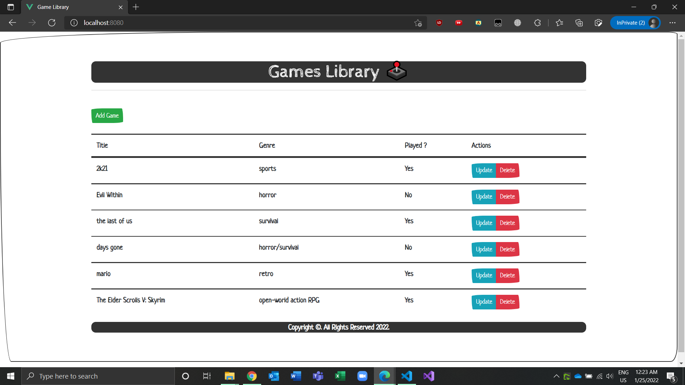
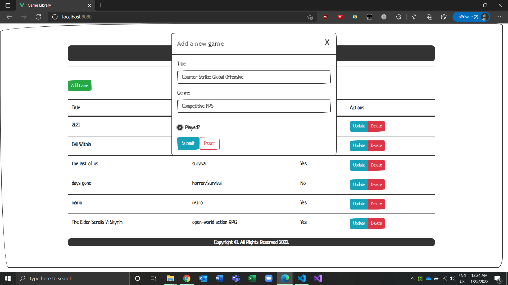
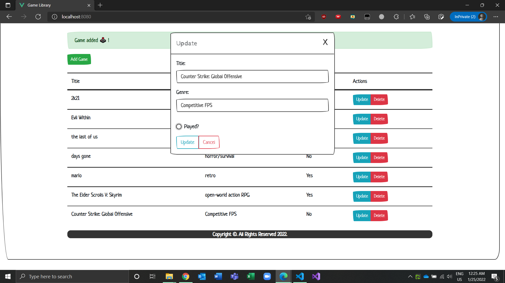

# Game App Library

---

A game app library where backend is built using flask and frontend is built using vuejs.

# Main Features:

---

- Users can crated game by clicking on the Add Game button.
- Users can updated games by clicking on the update button.
- Users can delete games by clicking on the delete button.

# Screenshots:

---

Home Page:



Add Game:



Update Game:



# Installation and setup instructions:

---

First clone down this repository. You will need node and npm globally installed on your machine. Also to run backend you need python and pip installed on your system.

it is recommended to create a virtual environment for your project. So that all the dependencies will be installed on this virtual environment and not globally.

### Server:

---

##### Setup of Virtual Environment:

If you want all your dependencies installed globally on your machine you can skip this part.

to create a virtual environment and active it first go to the directory where you cloned this repository and type the following commands.

```
$ python -m venv env
$ source env/Scripts/activate
```

now the virtual environment will be activated. To deactivate type

```
$ deactivate
```

##### installation of dependencies:

To install dependencies go to the backend directory and type the following command.

```
$ pip install -r requirements.txt
```

##### Start the server:

Type

```
$ python main.py
```

This will let the server up and running.

### Client:

---

To run the client go to the frontend directory and type the following commands.

```
$ npm install
$ npm run serve
```

Now go to your favorite browser and on the search bar type

```
locahost:8080
```

This will let your app start running.
